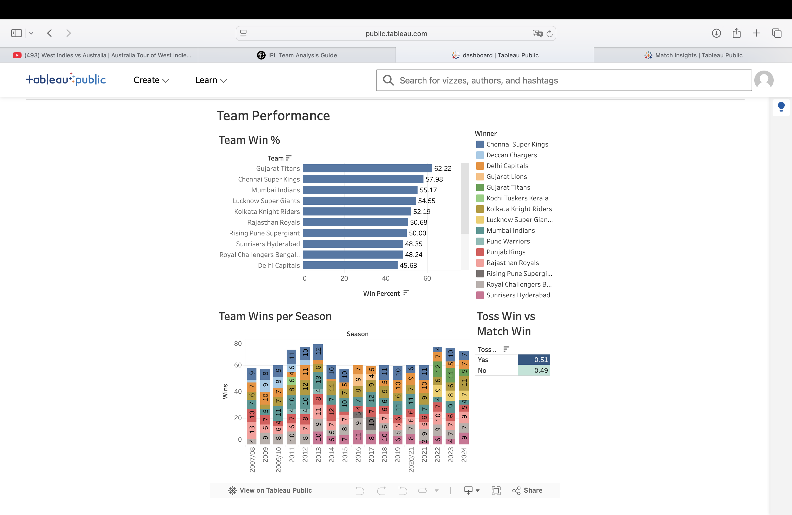
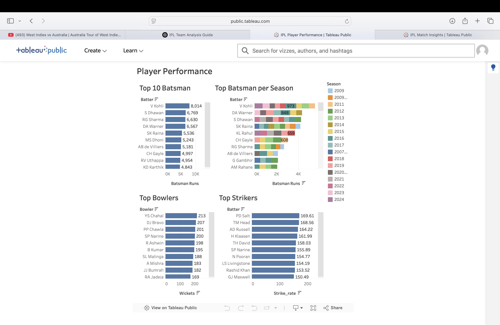
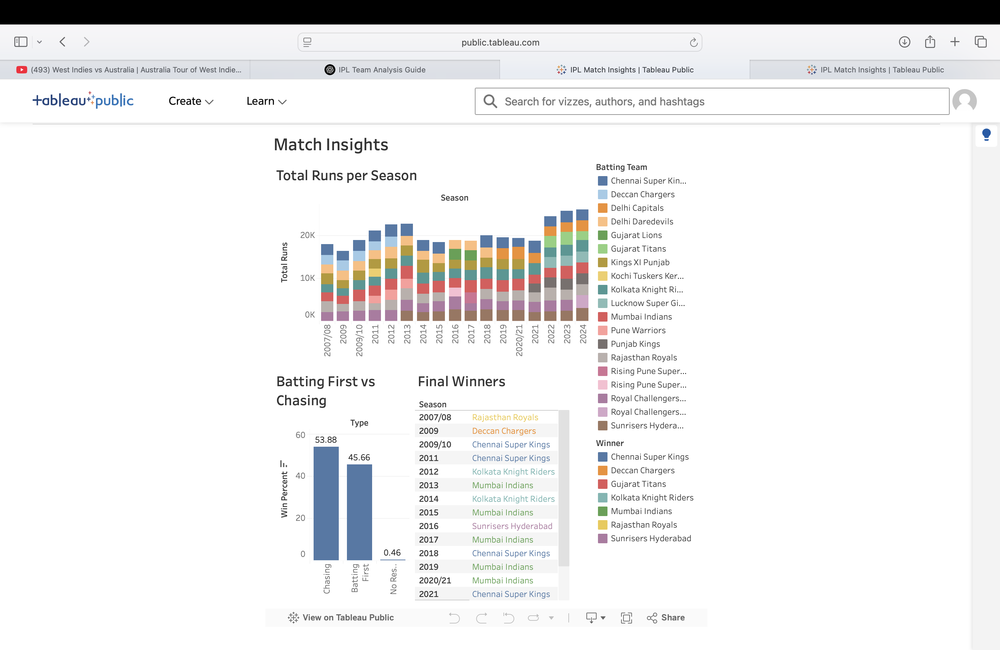

# 🏏 IPL Dashboard - Team & Player Performance Analytics

**📊 Visualize IPL 2008–2024 like never before — Team wins, player stats, match insights & business KPIs.**

### 🔗 [**Live Demo**](https://ipl-dashboard-7e4x.onrender.com)  
Hosted on **Render** using Streamlit + Plotly

---

## 📁 Project Overview

This interactive dashboard analyzes **IPL matches from 2008 to 2024**, focusing on:
- 🏆 Team win performance  
- 🧠 Toss decision impact  
- 🔥 Top batsmen & bowlers  
- 📈 Match-level insights (batting 1st vs chasing)

Built with **Python**, visualized using **Plotly**, and deployed using **Streamlit** on **Render**.

---

## 📌 Key Features

### 🟦 Team Performance
- ✅ Overall **win %** by each team  
- 📅 **Season-wise** win trends  
- 🪙 **Toss win vs Match win** correlation  

### 🟧 Player Performance
- 🏏 Top **run scorers**  
- ⚡ Highest **strike rates** (500+ runs)  
- 🎯 Top **wicket takers**  
- 📊 Season-wise **top batsmen** (grouped bar chart)  

### 🟥 Match Insights
- 📊 **Batting 1st vs Chasing** win percentages  
- 📉 Total team **runs per season**  
- 🏆 List of **IPL final winners** by season  

---

## 🧰 Tech Stack

| Tool        | Description                            |
|-------------|----------------------------------------|
| 🐍 Python    | Data manipulation, backend logic       |
| 📊 Streamlit | Web app framework for dashboards       |
| 📈 Plotly    | Interactive charts & graphs            |
| 📦 Pandas    | Data cleaning & transformation         |
| ☁️ Render    | Hosting platform for deployment        |

---

## 📂 Data Sources

- [📥 IPL  Dataset (2008–2024)]
- Deliveries Dataset(https://raw.githubusercontent.com/iyuvii7/IPL-dashboard/refs/heads/main/Ipl/deliveries.csv)
- Matches Dataset(https://raw.githubusercontent.com/iyuvii7/IPL-dashboard/refs/heads/main/Ipl/matches.csv)
- 🧼 Cleaned & feature-engineered files in `/data/` folder:
  - `team_win_stats.csv`
  - `top_batsman.csv`
  - `strike_rate.csv`
  - and 8 others…

---

## 🧠 What You'll Learn

- 📚 How to clean and merge real-world datasets  
- 📊 Create interactive dashboards using Streamlit + Plotly  
- 🚀 Deploy and share your own full-stack data project  

---

## 🚀 How to Run Locally

```bash
# 1. Clone the repository
git clone https://github.com/iyuvii7/ipl-dashboard.git
cd ipl-dashboard

# 2. Install dependencies
pip install -r requirements.txt

# 3. Run the app
streamlit run app.py
```

---

## 👤 Author

**Created by [Yuvraj Singh](https://www.vitaely.me/iyuvi)**  
📧 suwetayuvraj777@gmail.com  
🔗 [LinkedIn](https://www.linkedin.com/in/yuvraj-singh-086a68189/) &nbsp; | &nbsp; [GitHub](https://github.com/iyuvii7)

---

## 📊 Tableau Dashboards

Explore the same IPL analytics on Tableau:

### 🔷 [IPL Team Performance Dashboard](https://public.tableau.com/views/IPLdashboard_17516533632720/TeamPerformance?:language=en-US&:sid=&:redirect=auth&:display_count=n&:origin=viz_share_link)  


### 🔶 [Player Performance Dashboard](https://public.tableau.com/views/IPLPlayerPerformance_17516536425470/PlayerPerformance?:language=en-US&:sid=&:redirect=auth&:display_count=n&:origin=viz_share_link)  


### 🔴 [Match Insights Dashboard](https://public.tableau.com/views/IPLMatchInsights/MatchInsights?:language=en-US&:sid=&:redirect=auth&:display_count=n&:origin=viz_share_link)  


---

## 🌟 Future Improvements

- 🧮 Add **player comparison filters**  
- 💰 Add a **business insights tab** (sponsorships, brand value, ROI) 
